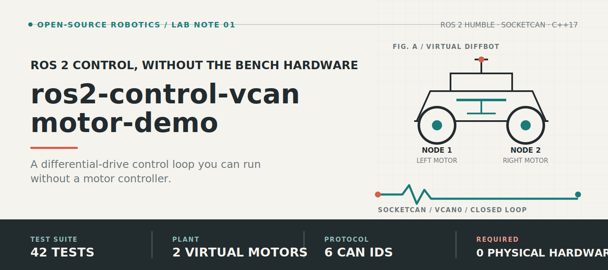
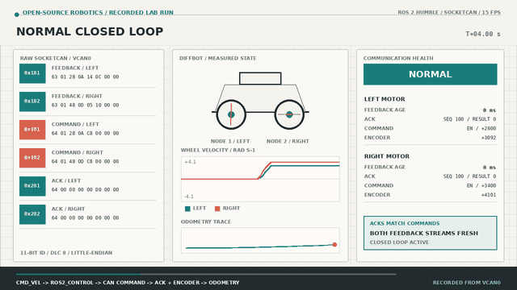
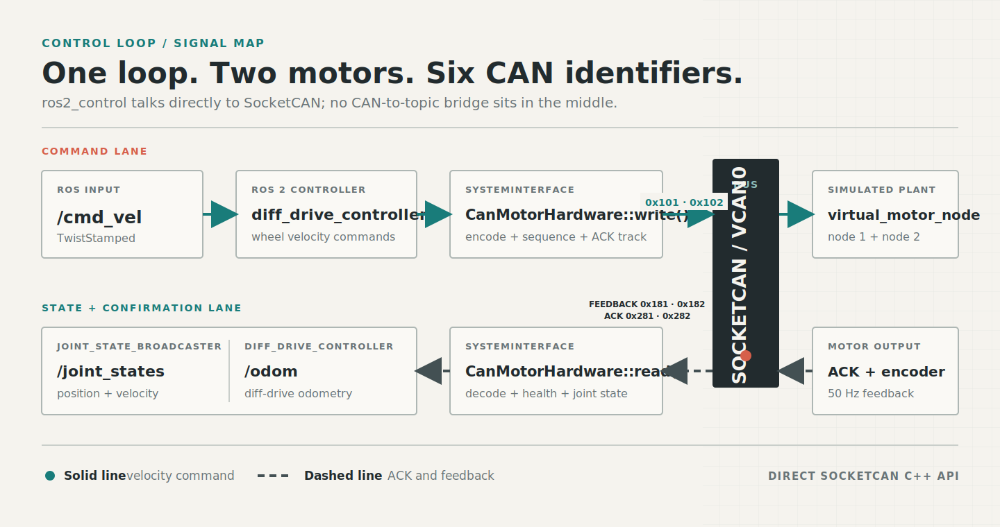
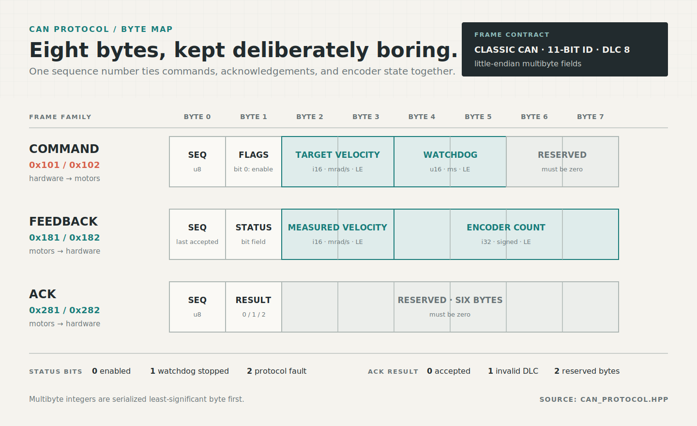
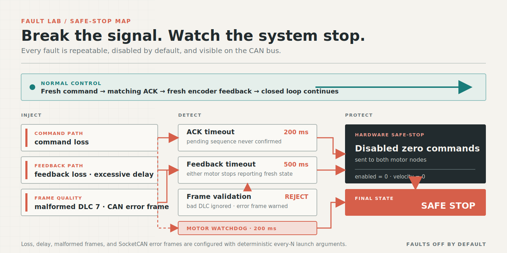

# ros2-control-vcan-motor-demo


[](https://github.com/Quchaosheng/ros2-control-vcan-motor-demo/actions/workflows/ci.yml)



A ROS 2 Humble differential-drive demo that runs a `ros2_control` hardware interface against two
virtual motors on SocketCAN. It is small enough to read end to end, but still covers the parts that
matter in a real driver: command and state interfaces, ACK tracking, encoder feedback, watchdogs,
safe stopping, receive filters, and deterministic CAN faults.

The live GitHub Actions badge above reports the ROS 2 Humble build and test workflow for this
repository. The project is licensed under [Apache-2.0](LICENSE).

## Demo

[](docs/demo/vcan_diffbot_demo.mp4)

The recording shows a normal closed loop followed by a real one-sided feedback timeout and the
disabled zero commands used to stop both motors. [Open the full MP4](docs/demo/vcan_diffbot_demo.mp4).

## What is included

| Component | Role |
| --- | --- |
| `diff_drive_controller` | Converts robot velocity commands into left and right wheel commands |
| `CanMotorHardware` | Implements `hardware_interface::SystemInterface` over SocketCAN |
| `virtual_motor_node` | Simulates acceleration, encoder counts, ACKs, and watchdog stopping |
| `joint_state_broadcaster` | Publishes wheel position and velocity state |
| Fault injection | Adds repeatable loss, delay, malformed frames, and CAN error frames |
| Launch tests | Exercise the protocol and complete control loop on isolated `vcan` interfaces |

## Data flow



Both endpoints use the `ros2_socketcan` C++ sender and receiver APIs directly. ROS topics are not
used as a bridge for CAN traffic.

## Quick start

### 1. Install dependencies

The tested environment is WSL2 with Ubuntu 22.04 and ROS 2 Humble installed at
`/opt/ros/humble`.

```bash
sudo apt-get update
sudo apt-get install -y \
  ros-humble-ros2-control \
  ros-humble-ros2-controllers \
  ros-humble-ros2-socketcan \
  ros-humble-xacro \
  ros-humble-robot-state-publisher \
  ros-humble-launch-testing-ament-cmake \
  ros-humble-ament-cmake-gtest \
  ros-humble-ament-cmake-pytest \
  can-utils
```

### 2. Build

Run these commands from the repository root inside WSL:

```bash
source /opt/ros/humble/setup.bash
colcon build --packages-select vcan_diffbot_demo
source install/setup.bash
```

### 3. Create the virtual CAN bus

```bash
bash src/vcan_diffbot_demo/scripts/setup_vcan.sh
```

The script creates `vcan0` if needed and brings it up. Run it again after the WSL virtual machine
restarts.

### 4. Launch the stack

```bash
source /opt/ros/humble/setup.bash
source install/setup.bash
ros2 launch vcan_diffbot_demo demo.launch.py
```

### Shared launch configuration

`can_interface` and all five configuration values are passed to the hardware through Xacro.
`can_interface`, `left_node_id`, `right_node_id`, and `encoder_counts_per_revolution` are also
passed directly to the virtual motor. The hardware carries `command_watchdog_ms` in every command
frame for the motor to enforce, while
`feedback_timeout_ms` remains the hardware-side feedback deadline. Keep the corresponding protocol
values aligned with the physical controller when using hardware CAN.

| Launch argument | Default | Purpose |
| --- | ---: | --- |
| `can_interface` | `vcan0` | SocketCAN interface name |
| `left_node_id` | `1` | Left motor node ID |
| `right_node_id` | `2` | Right motor node ID |
| `encoder_counts_per_revolution` | `4096` | Encoder scaling used for wheel position |
| `command_watchdog_ms` | `200` | Motor-side command watchdog period |
| `feedback_timeout_ms` | `500` | Hardware-side per-motor feedback deadline |

### 5. Drive the robot

Open another WSL terminal:

```bash
source /opt/ros/humble/setup.bash
source install/setup.bash
ros2 topic pub --rate 10 \
  /diffbot_base_controller/cmd_vel \
  geometry_msgs/msg/TwistStamped \
  "{twist: {linear: {x: 0.3}, angular: {z: 0.2}}}"
```

Stop the publisher with `Ctrl+C`. The controller timeout and motor watchdog return both wheel
velocities to zero.

## Physical CAN / HIL

For a physical SocketCAN adapter, disable the virtual motor and point the launch at `can0`:

```bash
ros2 launch vcan_diffbot_demo demo.launch.py can_interface:=can0 start_virtual_motor:=false
```

The physical controller must implement this demo's CAN IDs and byte layouts. Follow the
[physical SocketCAN bring-up and safety guide](docs/hardware-can.md) before attempting motion.

## Inspect the demo

Check controller and robot state:

```bash
ros2 control list_controllers
ros2 topic echo /joint_states
ros2 topic echo /diffbot_base_controller/odom
ros2 topic echo /diagnostics
```

`/diagnostics` publishes one CAN-bus status and one status for each motor.

| Status | Fields to inspect |
| --- | --- |
| Bus | `can_interface`, `state`, `last_can_error`, `stop_reason`, `command_watchdog_ms`, `feedback_timeout_ms` |
| Motor | `node_id`, `feedback_age_ms`, `pending_ack_count`, `last_ack_status`, `wheel_velocity_rad_s`, `ack_timeout`, `feedback_timeout` |

Watch raw CAN traffic:

```bash
candump -L vcan0
```

Normal traffic contains the following identifiers:

| Direction | Left | Right | Payload |
| --- | ---: | ---: | --- |
| Hardware to motor | `0x101` | `0x102` | Velocity command |
| Motor to hardware | `0x181` | `0x182` | Encoder feedback |
| Motor to hardware | `0x281` | `0x282` | Command ACK |

## CAN protocol

Application data frames use classic 11-bit CAN identifiers, DLC 8, and little-endian multibyte
fields.



### Velocity command

| Byte | Field |
| ---: | --- |
| 0 | Sequence number |
| 1 | Flags, bit 0 enables the motor |
| 2-3 | Target velocity in signed milliradians per second |
| 4-5 | Command watchdog in milliseconds |
| 6-7 | Reserved, must be zero |

### Encoder feedback

| Byte | Field |
| ---: | --- |
| 0 | Last accepted command sequence |
| 1 | Status bits: enabled, watchdog stopped, protocol fault |
| 2-3 | Measured velocity in signed milliradians per second |
| 4-7 | Signed encoder count |

### ACK

| Byte | Field |
| ---: | --- |
| 0 | Command sequence |
| 1 | Result: `0` accepted, `1` invalid DLC, `2` invalid reserved bytes |
| 2-7 | Reserved, must be zero |

The hardware tracks commands until matching ACKs arrive. A rejected, unexpected, or missing ACK
faults the hardware and sends disabled zero commands to both motors. Feedback loss on either motor
uses the same safe-stop path.

SocketCAN warning frames are reported in `/diagnostics` and do not stop the stack. BUS-OFF and
TX-timeout frames are fatal: the hardware clears commands, sends its one safe-stop attempt, latches
the fault, and returns an error until the hardware is reactivated.

## Fault injection

Faults are disabled by default. Every-N settings are deterministic, which keeps failures
repeatable during tests.



```bash
ros2 launch vcan_diffbot_demo demo.launch.py \
  drop_command_every_n:=5 \
  drop_feedback_every_n:=7 \
  feedback_delay_ms:=50 \
  malformed_feedback_every_n:=11 \
  error_frame_every_n:=13
```

| Launch argument | Behavior |
| --- | --- |
| `drop_command_every_n` | Drops every Nth command and its ACK |
| `drop_feedback_every_n` | Drops every Nth encoder feedback frame |
| `drop_command_node_id` | Drops every command and ACK for one motor node ID; `0` disables selection |
| `drop_feedback_node_id` | Drops all feedback for one motor node ID; `0` disables selection |
| `feedback_delay_ms` | Queues feedback until the configured delay expires |
| `malformed_feedback_every_n` | Sends every Nth feedback frame with DLC 7 |
| `error_frame_every_n` | Adds a SocketCAN error frame every Nth feedback frame |
| `spawn_controllers` | Set to `false` for hardware-only diagnostics |

For a deterministic one-sided timeout, drop right-motor feedback by node ID:

```bash
ros2 launch vcan_diffbot_demo demo.launch.py \
  drop_feedback_node_id:=2 \
  spawn_controllers:=false
```

Use the every-N arguments above for repeatable intermittent command or feedback loss.

## Tests

```bash
source /opt/ros/humble/setup.bash
colcon build --packages-select vcan_diffbot_demo
source install/setup.bash
colcon test --packages-select vcan_diffbot_demo
colcon test-result --verbose
```

The complete CTest suite covers:

- byte-level protocol encoding and validation;
- motor acceleration, encoder integration, and watchdog behavior;
- plugin loading, lifecycle safety, ACK health, and CAN filters;
- raw CAN faults and the complete differential-drive control loop;
- one-sided feedback loss and bounded safe-stop traffic.

It is expected to finish with zero errors, zero failures, and zero skipped tests.

Launch tests create process-specific virtual CAN interfaces instead of sharing `vcan0`. Creating
an interface requires root or passwordless non-interactive `sudo`. Each test deletes only the
interface it created.

## Learning guide

The Chinese [project learning and technical review guide](docs/learning-guide.zh-CN.md) covers the control
loop, module boundaries, CAN protocol, safety design, run commands, and 20 high-ROI questions.

## Project layout

```text
src/vcan_diffbot_demo/
|-- config/                  controller and virtual motor parameters
|-- include/                 CAN protocol, filters, health tracking, hardware interface
|-- launch/demo.launch.py    complete demo launch
|-- scripts/setup_vcan.sh    idempotent vcan setup
|-- src/                     hardware plugin and virtual motor node
|-- test/                    unit and SocketCAN launch tests
`-- urdf/                    DiffBot model and ros2_control description
```

## Troubleshooting

### `vcan0` does not exist

Recreate it after restarting WSL:

```bash
bash src/vcan_diffbot_demo/scripts/setup_vcan.sh
```

### Tests cannot create an interface

Run the tests as root or configure passwordless access for the required `ip link` commands. Test
setup uses `sudo -n`, so it exits instead of waiting for a password prompt.

### The hardware reports an ACK or feedback timeout

Check that only one demo stack is using `vcan0`, then inspect the bus:

```bash
candump -L vcan0
```

You should see command, ACK, and feedback frames for both node IDs.

## Demo scope

This repository validates the software control contract, SocketCAN transport, state feedback,
watchdogs, and safe-stop behavior. `vcan` does not model physical motor loads, electrical CAN
faults, arbitration timing, encoder noise, or production safety certification. Those require real
hardware, bus instrumentation, calibration, and system-level safety analysis.

## References

- [ros2_control demos, example 2](https://github.com/ros-controls/ros2_control_demos/tree/master/example_2)
- [ros2_control](https://github.com/ros-controls/ros2_control)
- [ros2_controllers](https://github.com/ros-controls/ros2_controllers)
- [ros2_socketcan](https://github.com/autowarefoundation/ros2_socketcan)
