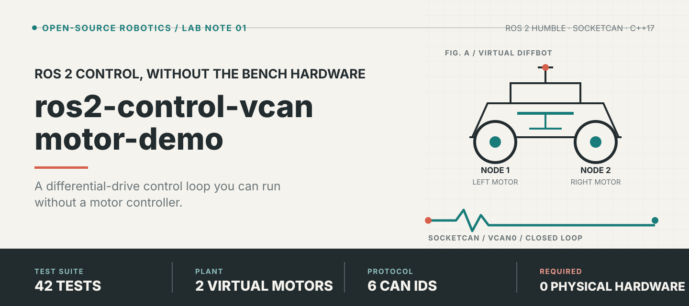
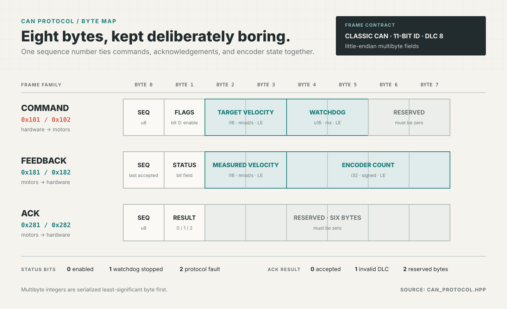
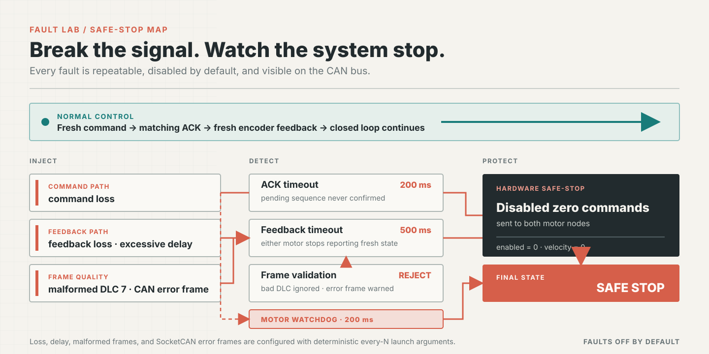

# ros2-control-vcan-motor-demo

[English](README.md) | **简体中文**


[](https://github.com/Quchaosheng/ros2-control-vcan-motor-demo/actions/workflows/ci.yml)



这是一个 ROS 2 Humble 差速底盘演示：通过 SocketCAN，让 `ros2_control` 硬件接口
驱动两个虚拟电机。项目规模小、可从头读完，同时覆盖真实驱动需要的关键问题：
命令和状态接口、ACK 跟踪、编码器反馈、看门狗、安全停机、接收过滤器和确定性
CAN 故障注入。

上方的 GitHub Actions 徽章实时反映本仓库的 ROS 2 Humble 构建与测试工作流。
本项目使用 [Apache-2.0](LICENSE) 许可证。

## 演示

[](docs/demo/vcan_diffbot_demo.mp4)

视频先展示正常闭环，再展示单侧反馈超时，以及用于停止两个电机的禁用零速度命令。
[打开完整 MP4](docs/demo/vcan_diffbot_demo.mp4)。

## 组件

| 组件 | 作用 |
| --- | --- |
| `diff_drive_controller` | 将机器人速度转换为左右轮命令 |
| `CanMotorHardware` | 通过 SocketCAN 实现 `hardware_interface::SystemInterface` |
| `virtual_motor_node` | 模拟加速度、编码器计数、ACK 和看门狗停机 |
| `joint_state_broadcaster` | 发布轮子位置与速度状态 |
| 故障注入 | 可重复地注入丢包、延迟、畸形帧和 CAN 错误帧 |
| Launch 测试 | 在隔离的 `vcan` 接口上测试协议和完整控制回路 |

## 数据流


两端直接使用 `ros2_socketcan` 的 C++ 收发 API，CAN 流量不通过 ROS topic 桥接。

## 快速开始

测试环境为 WSL2 Ubuntu 22.04，已安装 ROS 2 Humble（`/opt/ros/humble`）。

### 1. 安装依赖

```bash
sudo apt-get update
sudo apt-get install -y \
  ros-humble-ros2-control ros-humble-ros2-controllers \
  ros-humble-ros2-socketcan ros-humble-xacro \
  ros-humble-robot-state-publisher ros-humble-launch-testing-ament-cmake \
  ros-humble-ament-cmake-gtest ros-humble-ament-cmake-pytest can-utils
```

### 2. 构建

```bash
source /opt/ros/humble/setup.bash
colcon build --packages-select vcan_diffbot_demo
source install/setup.bash
```

### 3. 创建虚拟 CAN 总线

```bash
bash src/vcan_diffbot_demo/scripts/setup_vcan.sh
```

脚本会按需创建并启动 `vcan0`。WSL 虚拟机重启后需要再次运行。

### 4. 启动系统

```bash
source /opt/ros/humble/setup.bash
source install/setup.bash
ros2 launch vcan_diffbot_demo demo.launch.py
```

### Launch 参数说明

`can_interface` 和全部六个配置值都通过 Xacro 传给硬件。`can_interface`、
`left_node_id`、`right_node_id` 和 `encoder_counts_per_revolution` 还会直接传给
虚拟电机。硬件在每一帧命令中携带 `command_watchdog_ms`，由电机侧强制执行；
`ack_timeout_ms` 是命令 ACK 的硬件侧截止时间，`feedback_timeout_ms` 则是每个
电机的反馈截止时间。使用硬件 CAN 时，请让对应的协议取值与真实控制器保持一致。

| 参数 | 默认值 | 用途 |
| --- | ---: | --- |
| `can_interface` | `vcan0` | SocketCAN 接口名 |
| `left_node_id` | `1` | 左电机节点 ID |
| `right_node_id` | `2` | 右电机节点 ID |
| `encoder_counts_per_revolution` | `4096` | 轮子位置的编码器缩放 |
| `command_watchdog_ms` | `200` | 电机侧命令看门狗周期 |
| `ack_timeout_ms` | `200` | ACK 回复的硬件侧截止时间 |
| `feedback_timeout_ms` | `500` | 硬件侧单电机反馈截止时间 |

### 5. 驱动机器人

另开一个 WSL 终端发布速度命令：

```bash
source /opt/ros/humble/setup.bash
source install/setup.bash
ros2 topic pub --rate 10 /diffbot_base_controller/cmd_vel \
  geometry_msgs/msg/TwistStamped \
  "{twist: {linear: {x: 0.3}, angular: {z: 0.2}}}"
```

按 `Ctrl+C` 停止发布。控制器超时和电机看门狗会将两个轮子的速度恢复为零。

## 物理 CAN / HIL

使用真实 SocketCAN 适配器时，关闭虚拟电机并指定 `can0`：

```bash
ros2 launch vcan_diffbot_demo demo.launch.py can_interface:=can0 start_virtual_motor:=false
```

真实控制器必须实现本项目的 CAN ID 和字节布局。尝试运动前请阅读
[物理 SocketCAN 上电与安全指南](docs/hardware-can.md)。

## 观测演示

检查控制器与机器人状态：

```bash
ros2 control list_controllers
ros2 topic echo /joint_states
ros2 topic echo /diffbot_base_controller/odom
ros2 topic echo /diagnostics
```

`/diagnostics` 会发布一条 CAN 总线状态和每个电机各一条状态。

| 状态 | 需要关注的字段 |
| --- | --- |
| Bus | `can_interface`、`state`、`last_can_error`、`stop_reason`、`command_watchdog_ms`、`ack_timeout_ms`、`feedback_timeout_ms` |
| Motor | `node_id`、`feedback_age_ms`、`pending_ack_count`、`last_ack_status`、`wheel_velocity_rad_s`、`ack_timeout`、`feedback_timeout` |

观察原始 CAN 流量：

```bash
candump -L vcan0
```

正常流量包含以下标识符：

| 方向 | 左 | 右 | 载荷 |
| --- | ---: | ---: | --- |
| 硬件 → 电机 | `0x101` | `0x102` | 速度命令 |
| 电机 → 硬件 | `0x181` | `0x182` | 编码器反馈 |
| 电机 → 硬件 | `0x281` | `0x282` | 命令 ACK |

## CAN 协议

应用数据帧使用经典 11-bit CAN ID、DLC 8 和小端多字节字段。



### 速度命令

| 字节 | 字段 |
| ---: | --- |
| 0 | 序列号 |
| 1 | Flags，bit 0 使能电机 |
| 2-3 | 目标速度，有符号毫弧度每秒 |
| 4-5 | 命令看门狗，毫秒 |
| 6-7 | 保留，必须为 0 |

### 编码器反馈

| 字节 | 字段 |
| ---: | --- |
| 0 | 最后接受的命令序列号 |
| 1 | 状态位：使能、看门狗停机、协议故障 |
| 2-3 | 测得速度，有符号毫弧度每秒 |
| 4-7 | 有符号编码器计数 |

### ACK

| 字节 | 字段 |
| ---: | --- |
| 0 | 命令序列号 |
| 1 | 结果：`0` 接受，`1` DLC 非法，`2` 保留字节非法 |
| 2-7 | 保留，必须为 0 |

硬件会持续跟踪命令，直到收到匹配的 ACK。收到拒绝、意外或缺失 ACK 时，硬件会
故障锁存并向两个电机发送禁用零命令；任一电机反馈丢失也走相同的安全停机路径。

SocketCAN 警告帧会报告到 `/diagnostics`，但不会停止系统。BUS-OFF 和 TX-timeout
帧是致命错误：硬件清空命令、发送唯一一次安全停机尝试、锁存故障，并在硬件重新
激活前持续返回错误。

## 故障注入

故障默认关闭，`every_n` 参数具有确定性，适合重复测试：



```bash
ros2 launch vcan_diffbot_demo demo.launch.py \
  drop_command_every_n:=5 \
  drop_feedback_every_n:=7 \
  feedback_delay_ms:=50 \
  malformed_feedback_every_n:=11 \
  error_frame_every_n:=13
```

| Launch 参数 | 行为 |
| --- | --- |
| `drop_command_every_n` | 每第 N 条命令及其 ACK 被丢弃 |
| `drop_feedback_every_n` | 每第 N 帧编码器反馈被丢弃 |
| `drop_command_node_id` | 丢弃某个电机节点 ID 的全部命令与 ACK；`0` 表示不选择 |
| `drop_feedback_node_id` | 丢弃某个电机节点 ID 的全部反馈；`0` 表示不选择 |
| `feedback_delay_ms` | 将反馈排队，直到配置的延迟到期 |
| `malformed_feedback_every_n` | 每第 N 帧反馈以 DLC 7 发送 |
| `error_frame_every_n` | 每第 N 帧反馈时附加一个 SocketCAN 错误帧 |
| `spawn_controllers` | 设为 `false` 时只做硬件诊断 |

要构造确定性的单侧超时，可按节点 ID 丢弃右电机反馈：

```bash
ros2 launch vcan_diffbot_demo demo.launch.py \
  drop_feedback_node_id:=2 \
  spawn_controllers:=false
```

需要可重复的间歇性命令或反馈丢失时，使用上面的 every-N 参数。

## 测试

```bash
source /opt/ros/humble/setup.bash
colcon build --packages-select vcan_diffbot_demo
source install/setup.bash
colcon test --packages-select vcan_diffbot_demo
colcon test-result --verbose
```

完整的 CTest 套件覆盖：

- 字节级协议编码与校验；
- 电机加速度、编码器积分与看门狗行为；
- 插件加载、生命周期安全、ACK 健康与 CAN 过滤器；
- 原始 CAN 故障与完整差速控制回路；
- 单侧反馈丢失与有界安全停机流量。

预期结果是 0 错误、0 失败、0 跳过。

Launch 测试会创建进程专用的虚拟 CAN 接口，而不是共享 `vcan0`。创建接口需要
root 或无需交互密码的 `sudo`；每个测试只删除自己创建的接口。

## 项目结构

```text
src/vcan_diffbot_demo/
|-- config/                  控制器与虚拟电机参数
|-- include/                 CAN 协议、过滤器、健康跟踪、硬件接口
|-- launch/demo.launch.py    完整演示启动文件
|-- scripts/setup_vcan.sh    幂等的 vcan 初始化脚本
|-- src/                     硬件插件与虚拟电机节点
|-- test/                    单元测试与 SocketCAN launch 测试
`-- urdf/                    DiffBot 模型与 ros2_control 描述
```

## 故障排查

### `vcan0` 不存在

WSL 重启后重新创建：

```bash
bash src/vcan_diffbot_demo/scripts/setup_vcan.sh
```

### 测试无法创建接口

请以 root 身份运行测试，或为所需的 `ip link` 命令配置免密 `sudo`。测试初始化
使用 `sudo -n`，因此会直接退出而不会等待密码输入。

### 硬件报告 ACK 或反馈超时

确认只有一个演示系统在使用 `vcan0`，然后检查总线：

```bash
candump -L vcan0
```

应当能看到两个节点 ID 的命令、ACK 和反馈帧。

## 项目范围

本仓库验证软件控制契约、SocketCAN 传输、状态反馈、看门狗和安全停机。`vcan`
不模拟真实电机负载、电气 CAN 故障、仲裁时序、编码器噪声或生产安全认证；这些
需要真实硬件、总线仪器、标定和系统级安全分析。

## 参考资料

- [ros2_control demos, example 2](https://github.com/ros-controls/ros2_control_demos/tree/master/example_2)
- [ros2_control](https://github.com/ros-controls/ros2_control)
- [ros2_controllers](https://github.com/ros-controls/ros2_controllers)
- [ros2_socketcan](https://github.com/autowarefoundation/ros2_socketcan)
