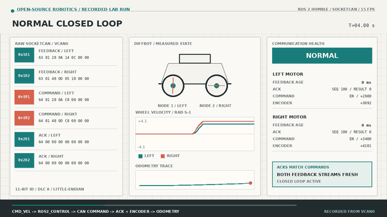
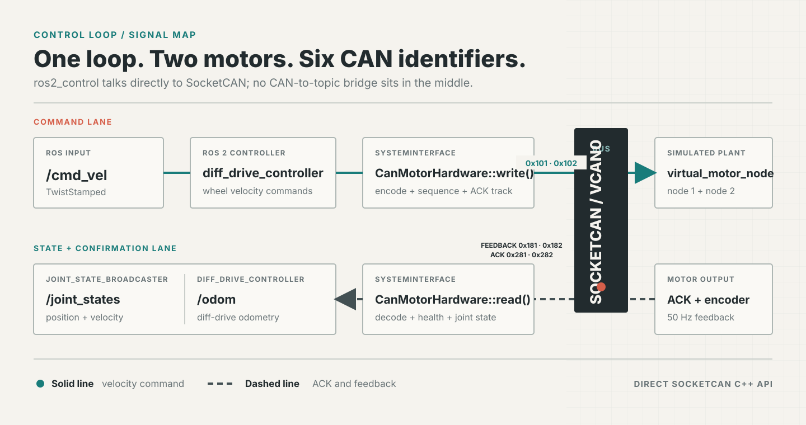

# ros2-control-vcan-motor-demo

[English](README.md) | **简体中文**


[](https://github.com/Quchaosheng/ros2-control-vcan-motor-demo/actions/workflows/ci.yml)

这是一个 ROS 2 Humble 差速底盘演示：通过 SocketCAN，让 `ros2_control` 硬件接口
驱动两个虚拟电机。项目规模小、可从头读完，同时覆盖真实驱动需要的关键问题：
命令和状态接口、ACK 跟踪、编码器反馈、看门狗、安全停机、接收过滤器和确定性
CAN 故障注入。项目使用 Apache-2.0 许可证。

## 演示

[](docs/demo/vcan_diffbot_demo.mp4)

视频先展示正常闭环，再展示单侧反馈超时，以及用于停止两个电机的禁用零速度命令。
[打开完整 MP4](docs/demo/vcan_diffbot_demo.mp4)。

## 组件

| 组件 | 作用 |
| --- | --- |
| `diff_drive_controller` | 将机器人速度转换为左右轮命令 |
| `CanMotorHardware` | 通过 SocketCAN 实现 `hardware_interface::SystemInterface` |
| `virtual_motor_node` | 模拟加速度、编码器计数、ACK 和看门狗停机 |
| `joint_state_broadcaster` | 发布轮子位置与速度状态 |
| 故障注入 | 可重复地注入丢包、延迟、畸形帧和 CAN 错误帧 |
| Launch 测试 | 在隔离的 `vcan` 接口上测试协议和完整控制回路 |

## 数据流



两端直接使用 `ros2_socketcan` 的 C++ 收发 API，CAN 流量不通过 ROS topic 桥接。

## 快速开始

测试环境为 WSL2 Ubuntu 22.04，已安装 ROS 2 Humble（`/opt/ros/humble`）。

### 1. 安装依赖

```bash
sudo apt-get update
sudo apt-get install -y \
  ros-humble-ros2-control ros-humble-ros2-controllers \
  ros-humble-ros2-socketcan ros-humble-xacro \
  ros-humble-robot-state-publisher ros-humble-launch-testing-ament-cmake \
  ros-humble-ament-cmake-gtest ros-humble-ament-cmake-pytest can-utils
```

### 2. 构建

```bash
source /opt/ros/humble/setup.bash
colcon build --packages-select vcan_diffbot_demo
source install/setup.bash
```

### 3. 创建虚拟 CAN 总线

```bash
bash src/vcan_diffbot_demo/scripts/setup_vcan.sh
```

脚本会按需创建并启动 `vcan0`。WSL 虚拟机重启后需要再次运行。

### 4. 启动系统

```bash
source /opt/ros/humble/setup.bash
source install/setup.bash
ros2 launch vcan_diffbot_demo demo.launch.py
```

常用 Launch 参数：

| 参数 | 默认值 | 用途 |
| --- | ---: | --- |
| `can_interface` | `vcan0` | SocketCAN 接口名 |
| `left_node_id` | `1` | 左电机节点 ID |
| `right_node_id` | `2` | 右电机节点 ID |
| `encoder_counts_per_revolution` | `4096` | 轮子位置的编码器缩放 |
| `command_watchdog_ms` | `200` | 电机侧命令看门狗周期 |
| `ack_timeout_ms` | `200` | ACK 回复的硬件侧截止时间 |
| `feedback_timeout_ms` | `500` | 硬件侧单电机反馈截止时间 |

### 5. 驱动机器人

另开一个 WSL 终端发布速度命令：

```bash
source /opt/ros/humble/setup.bash
source install/setup.bash
ros2 topic pub --rate 10 /diffbot_base_controller/cmd_vel \
  geometry_msgs/msg/TwistStamped \
  "{twist: {linear: {x: 0.3}, angular: {z: 0.2}}}"
```

按 `Ctrl+C` 停止发布。控制器超时和电机看门狗会将两个轮子的速度恢复为零。

## 物理 CAN / HIL

使用真实 SocketCAN 适配器时，关闭虚拟电机并指定 `can0`：

```bash
ros2 launch vcan_diffbot_demo demo.launch.py can_interface:=can0 start_virtual_motor:=false
```

真实控制器必须实现本项目的 CAN ID 和字节布局。尝试运动前请阅读
[物理 SocketCAN 上电与安全指南](docs/hardware-can.md)。

## 观测与协议

```bash
ros2 control list_controllers
ros2 topic echo /joint_states
ros2 topic echo /diffbot_base_controller/odom
ros2 topic echo /diagnostics
candump -L vcan0
```

正常帧使用经典 11-bit CAN ID、DLC 8 和小端多字节字段：硬件到电机的命令是
`0x101/0x102`，电机到硬件的编码器反馈是 `0x181/0x182`，ACK 是
`0x281/0x282`。收到拒绝、意外或缺失 ACK 时，硬件会故障锁存并向两个电机发送
禁用零命令；任一电机反馈丢失也走相同的安全停机路径。

## 故障注入

故障默认关闭，`every_n` 参数具有确定性，适合重复测试：

```bash
ros2 launch vcan_diffbot_demo demo.launch.py \
  drop_command_every_n:=5 drop_feedback_every_n:=7 \
  feedback_delay_ms:=50 malformed_feedback_every_n:=11 \
  error_frame_every_n:=13
```

单侧反馈超时示例：

```bash
ros2 launch vcan_diffbot_demo demo.launch.py \
  drop_feedback_node_id:=2 spawn_controllers:=false
```

## 测试

```bash
source /opt/ros/humble/setup.bash
colcon build --packages-select vcan_diffbot_demo
source install/setup.bash
colcon test --packages-select vcan_diffbot_demo
colcon test-result --verbose
```

测试覆盖字节级协议、加速度和编码器积分、看门狗、插件生命周期、ACK 健康、CAN
过滤器、原始 CAN 故障、完整差速控制回路、单侧反馈丢失和有界安全停机。
预期结果是 0 错误、0 失败、0 跳过。Launch 测试会创建进程专用的虚拟 CAN 接口，
需要 root 或无需交互密码的 `sudo`。

## 项目范围

本仓库验证软件控制契约、SocketCAN 传输、状态反馈、看门狗和安全停机。`vcan`
不模拟真实电机负载、电气 CAN 故障、仲裁时序、编码器噪声或生产安全认证；这些
需要真实硬件、总线仪器、标定和系统级安全分析。
